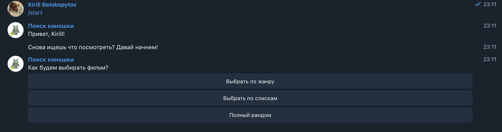
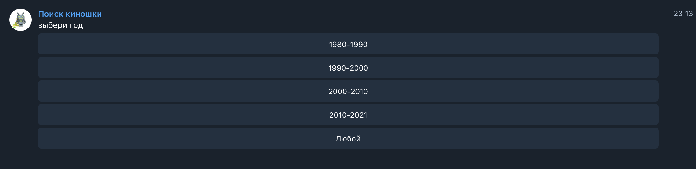
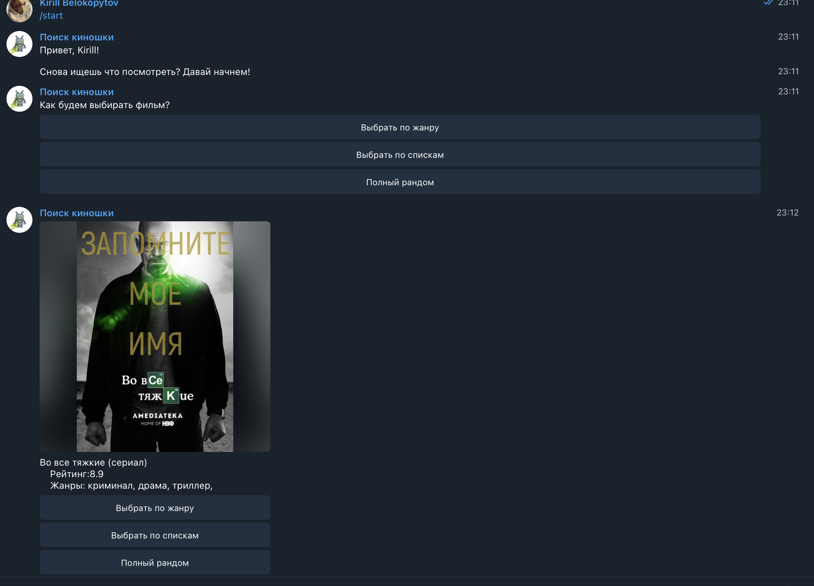
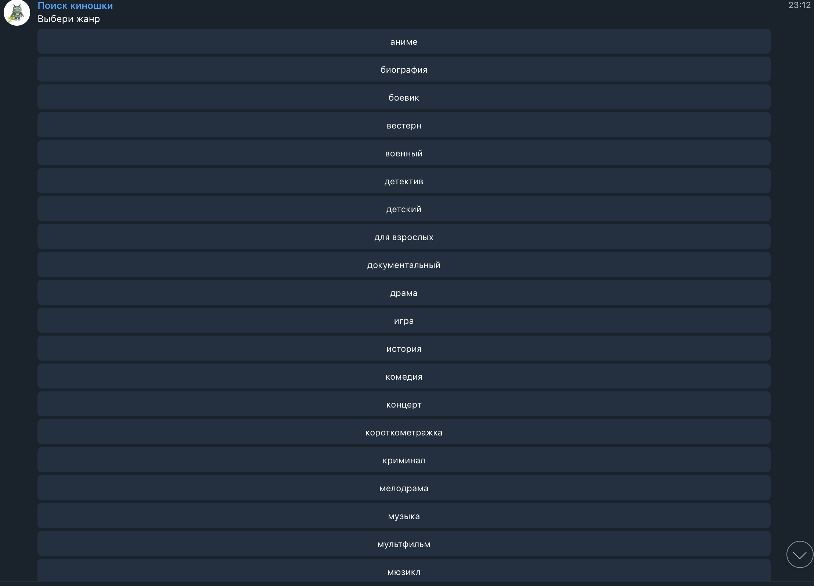
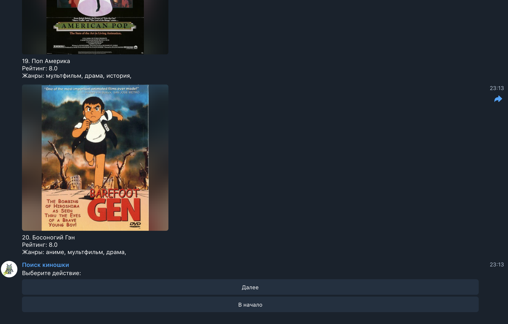

# Поиск Киношки

Телеграм бот позволяет выбирать фильмы. Рандомный фильм/списки по жанрам/списки по годам и десятилетиям. Я реализовал работу с сторонней API и прописал всю логику внутри телеграм бота. Данного бота можно найти в телеграме(@kinoMoodBot).
### Функциональность бота:

### Скриншоты: 

### На проекте были использованы следующие технологии:

- Node.js
- JavaScript
- Telegram API
- Kinopoisk API
- Kinopoisk Unoficcial API
- IMDB API
- Heroku
